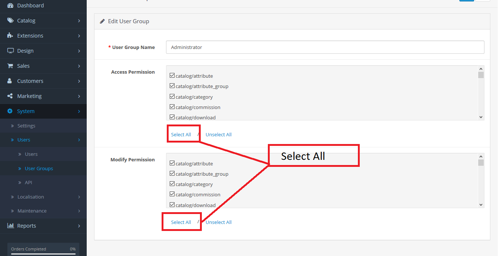
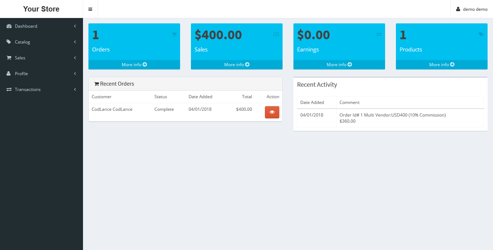
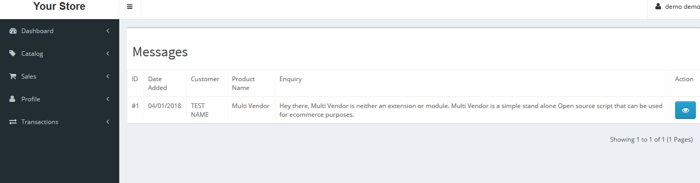
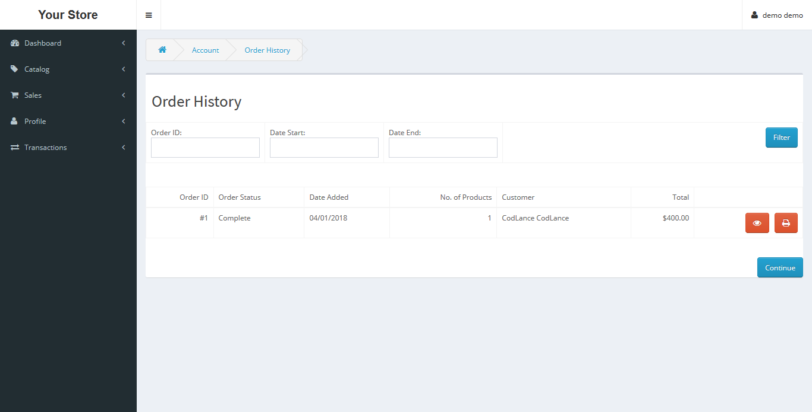
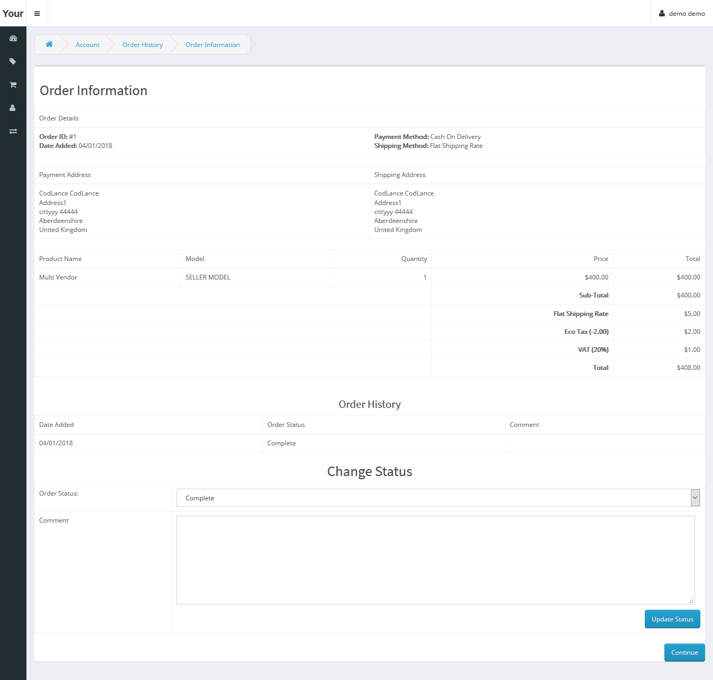
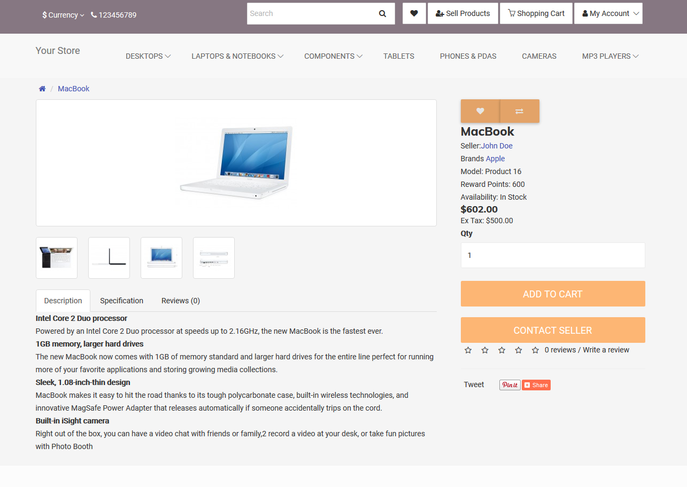

# Multi Vendor 

Hey there, Multi Vendor is neither an extension or module.  
Multi Vendor is a simple stand alone Open source script that can be used for ecommerce purposes.
## Features
Multi Vendor is built on top of OpenCart 3.x thus it inherits all the inbuilt  OpenCart features .
You can easily use the Multi Vendor to create a Marketplace store where both admin and customers can sell their goods and services.
The admin will earn money through Membership plans and commissions on sales
Checkout the Multi Vendor [DEMO](http://demo.codlance.com)

Customers can apply to become sellers on your store(s).
Multi Vendor features include

1. Register / Login seller account from frontend .
2. Start uploading category , products, options from seller panel
3. Different images folder for each seller.
4. Seller can change status of order.
6. Seller profile page where customer can see products by vendor.
7. Seller payment options Paypal,Cheque and Bank transfer.
8. Physical and downloadable product option for seller
9. Seller membership application needs approval from the main admin.
10. Sellers add products,categories then await for admin's  approval.
11. Admin also can login into seller account from backend using login seller link.
12. Admin can add/assign product to seller from backend.
13. Check seller's transaction, products against that transactions and the customers
14. Seller  Membership Plans and commission based charges
15. Customers can review sellers.
16. Different seller dashboard.
27. Custom settings in the admin back end for further customization.

## Installation
Unzip the zip files to your web directory.  

Rename the `admin/config-dist.php`,`seller/config-dist.php` and `config-dist.php` files to **`config.php`**.  
Make sure the `seller/config.php`, `admin/config.php` and `config.php` files have read and write permissions.  

Visit `http://yourdomain.com/install` to start the installtion process

Login to your admin end, give admins permissions by navigating to `System->Users->User groups (edit)` **select all** and save. 
   
Configure these seller settings in the sellers tab
- Select Default Seller  
- Seller Account Terms   
- Select Default commission  
- Seller default categories permission  
- Seller Order Statuses  
- Seller Eligible for Payment

You can now access the seller dashboard at yourdomain/seller/index.php  
  
##  Screenshots 
###  Seller  dashboard  

###  Seller  products  

###  Admin Seller settings  

###  Seller Messages

###  Seller  Order history  

###  Seller  Order  Info 

## To do
Fix code intentions and adapt standard OpenCart coding styles.
## Extensions
Multi Vendor extensions can be created using the same pattern like OpenCart extensions.
VQMODS will work though you have to check if they really fit with the Multi Vendor script.
You can submit your extensions to [CodLance](https://codlance.com) for sale or for free.
## Themes
Get  [Journal Theme for MultiVendor](https://yiirestful.ovicko.com/journal-theme-for-multivendor-is-finally-here/)  
  
Get the latest Multi Vendor themes on [our website](https://codlance.com)

## Credits
This software is built on top of [OpenCart](http://opencart.com) .
Additional software and development done by [Ovicko](https://ovicko.com).

Submit any issues so that we help make this a great software.
## Support this Project

# Disclaimer
This program is distributed in the hope that it will be useful,
but WITHOUT ANY WARRANTY; without even the implied warranty of
MERCHANTABILITY or FITNESS FOR A PARTICULAR PURPOSE. Thus the author of the software will not be responsible for any losses either direct or indirect resulting from use of this software.   See the
GNU General Public License for more details.

You should have received a copy of the GNU General Public License
 along with this program. If not, see <http://www.gnu.org/licenses/>.
 
 Check this while installing --
 
 You nay face this issue like --
 
 permission denied, make 777 to the specific folder and their after you may get unwrittable issue in admin/config, seller/config and in main config just make 777 and you get install.
 
